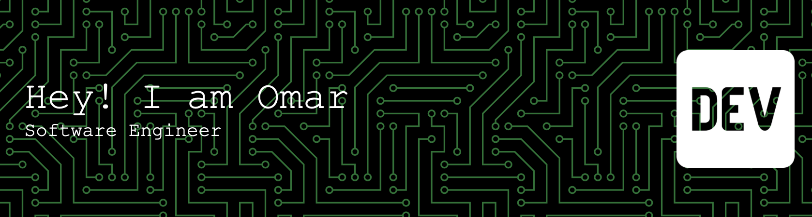

# Hi, I'm Omar Nuhman

Backend Engineer | AI Enthusiast | Builder of Practical Systems

---

## About Me

I’m a backend-focused developer with an interest in building scalable systems and exploring applied AI. I enjoy working on tools and services that solve real engineering problems, with a focus on clean architecture, performance, and maintainability.

Currently, I’m deepening my skills in backend engineering and AI integration within real-world systems.

---

## Tech Focus

- **Backend Development** (APIs, system design, scalable services)
- **Artificial Intelligence** (applied AI, tool-using systems, automation)
- **Dev Tools & Automation**
- **Cloud & Containerized Systems**

---

## Skills

- Languages: Python, Java, JavaScript
- Backend: Node.js / Express, REST APIs
- Databases: SQL, NoSQL
- Tools: Docker, Git, CLI tooling
- Concepts: System Design, API Design, Logging & Observability

---

## Interests

- AI-powered developer tools
- Backend architecture & distributed systems
- Automation and CLI utilities
- Performance and system optimization

---

## Current Focus

- Building backend systems with real-world use cases
- Exploring AI agents and tool-using LLM systems
- Improving system design and architecture thinking

---

## Connect With Me

- LinkedIn: :contentReference[oaicite:0]{index=0} → https://lk.linkedin.com/in/ahamed-omar-nuhman-575597293
- GitHub: https://github.com/omar-nuhman

---

> “Build systems that are simple, but not simplistic.”

<!--
**omar-nuhman/omar-nuhman** is a ✨ _special_ ✨ repository because its `README.md` (this file) appears on your GitHub profile.

Here are some ideas to get you started:

- 🔭 I’m currently working on ...
- 🌱 I’m currently learning ...
- 👯 I’m looking to collaborate on ...
- 🤔 I’m looking for help with ...
- 💬 Ask me about ...
- 📫 How to reach me: ...
- 😄 Pronouns: ...
- ⚡ Fun fact: ...
-->
